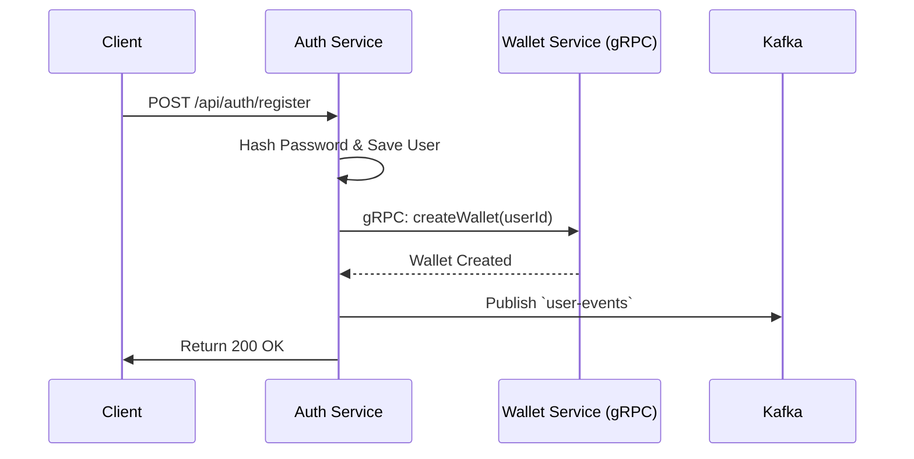

# Central Payment Ecosystem - Authentication Service

Welcome to the **Authentication Service**! This module is responsible for user registration, identity management, and generating the JWTs used across the Central Payment Ecosystem.

> **Explore the Ecosystem:** This repository is part of a larger microservices architecture.
> - [API Gateway](https://github.com/sarvesh873/101_Central_API-Gateway) - The central entry point and JWT verifier.
> - **Authentication Service (You are here)** - Manages users and registration.
> - [Wallet Service](https://github.com/sarvesh873/101_Central_Wallet-Service) - Manages balances and holds.
> - [Reward Service](https://github.com/sarvesh873/101_Central_Reward-Service) - Evaluates transactions to issue rewards.
> - [Transaction Service](https://github.com/sarvesh873/101_Central_Transaction-Service) - Core engine handling two-phase commits.

---

## 🛡️ Role in the Architecture

When a user signs up via the API Gateway, the Authentication service takes charge of their onboarding flow. It ensures passwords are securely hashed and coordinates the setup of the user's financial profile.



### Responsibilities:
1. **User Management**: Creating and authenticating users.
2. **JWT Generation**: Issuing tokens for stateless authentication across the cluster.
3. **Wallet Provisioning (Synchronous)**: Makes a direct **gRPC** call to the Wallet Service to ensure every new user immediately gets an active wallet.
4. **Event Sourcing (Asynchronous)**: Publishes to Kafka (`user-events`) so other services (like Notification) can act on user creation.

## 🚀 Features

- **JWT-based Authentication**
- **User Management** (Create, Read, Update, Delete)
- **Role-based Access Control (RBAC)**
- **Virtual Threads** for improved concurrency
- **OpenAPI 3.0** documentation
- **Containerized** with Docker
- **CI/CD** ready
- **90%+ Test Coverage**

## 📋 Prerequisites

- Java 21 or higher
- Maven 3.8+
- Docker 20.10+ (optional)
- PostgreSQL 14+ (or compatible database)

## 🛠️ Installation

### Local Development

1. Clone the repository:
   ```bash
   git clone https://github.com/sarvesh873/101_Central_Authentication-Service.git
   cd 101_Central_Authentication-Service
   ```

2. Configure the database in `application.yml`:
   ```yaml
   spring:
     datasource:
       url: jdbc:postgresql://localhost:5432/auth_db
       username: your_username
       password: your_password
   ```

3. Build and run:
   ```bash
   mvn clean install
   mvn spring-boot:run
   ```

### Using Docker

```bash
docker-compose up -d
```

## 🔧 Configuration

| Environment Variable | Description | Default                                  |
|----------------------|-------------|------------------------------------------|
| `SERVER_PORT` | Application port | 8083                                     |
| `SPRING_DATASOURCE_URL` | Database URL | jdbc:postgresql://localhost:5432/auth_db |
| `JWT_SECRET` | Secret key for JWT | your-256-bit-secret                      |
| `JWT_EXPIRATION_MS` | JWT expiration time in milliseconds | 3600000 (1 hour)                         |


## 📚 API Documentation

Once the application is running, access the following:

- **Swagger UI**: http://localhost:8083/swagger-ui.html
- **OpenAPI 3.0 Docs**: http://localhost:8083/v3/api-docs

## 🧪 Testing

Run the test suite with coverage:

```bash
mvn clean test jacoco:report
```

## 🚀 Deployment upcoming

### Kubernetes

```bash
kubectl apply -f k8s/
```

### Helm

```bash
helm install auth-service ./charts/auth-service
```

## 🛡️ Security

- Password hashing with BCrypt
- JWT with RSA 256-bit encryption
- Role-based access control
- Input validation
- CORS protection
- CSRF protection (for web clients)

## 📈 Monitoring

The service exposes Prometheus metrics at `/actuator/prometheus` and includes:

- Request/response metrics
- JVM metrics
- Database connection pool metrics
- Custom business metrics

## 🤝 Contributing

1. Fork the repository
2. Create your feature branch (`git checkout -b feature/AmazingFeature`)
3. Commit your changes (`git commit -m 'Add some AmazingFeature'`)
4. Push to the branch (`git push origin feature/AmazingFeature`)
5. Open a Pull Request
